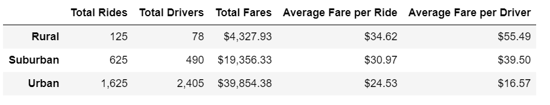
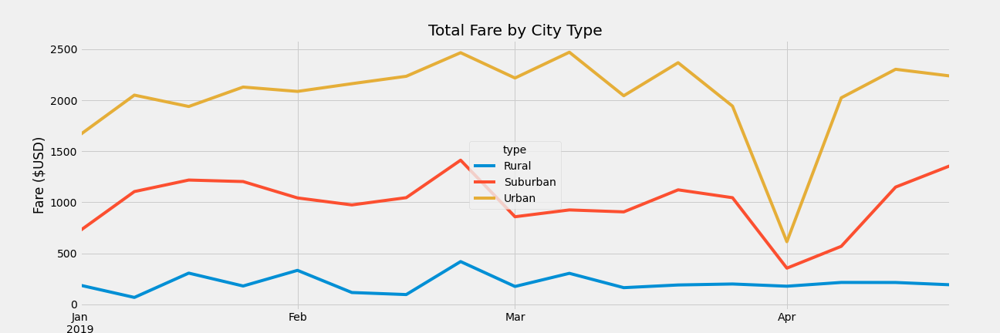

# PyBer Ride-Sharing Data Analysis

## Overview
At PyBer, a firm that focuses on ride-sharing, its CEO V. Isualize has tasked us to perform an explanatory analysis on some data in some very large obtained from a few csv files. Originally, in the first part of the project, several types of visualization were formed to obtain a better framework and picture of the relationships that existed between the type of city, the number of drivers and riders. 

For this second part of the project, V. Isualize and Omar are inquiring about a new assignment that also observes the city and ride data collected for all ride fares. Utilizing Python and Pandas, we will be creating a summary Data Frame of the ride-sharing data by city type while also using Matplotlib, in which we will create a multi-line graph that depicts the weekly fares for each city type. Through this portion of the analysis, we will obtain statistical data among the different city types as well as provide recommendations to V. Isualize that can help assist in addressing disparities among the city groups. 

The ultimate goal with this second portion of the project is to assist PyBer in providing better access to its ride sharing services and determine affordability for underserved neighborhoods. 

## Tech Used:
- Python
- Pandas
- Matplotlib

## Objectives:
- Create line, bar, scatter, bubble, pie, and box-and-whisker plots using Matplotlib.
- Add and modify features of Matplotlib charts.
- Add error bars to line and bar charts.
- Determine mean, median, and mode using Pandas, NumPy, and SciPy statistics.

## Results

### Summary DataFrame Results
For the first potion of the challenge, as we merged the two csv files to create one central source that located all the data information, we needed to create a summary DataFrame that encompassed the following per city type:
-	Total Rides
-	Total Drivers
-	Total Fares
-	Average Fare per Ride 
-	Average Fare per Driver

Examining the results, it can clearly be seen that Urban city types by far have the highest amounts of total rides, drivers, and fares compared to suburban and rural areas. Comparing rural and urban city types alone, urban cities collect a total of 13 times more rides than rural areas. Urban cities by far outpace the other two city categories, which signifies greater use of PyBer in urban areas than in the other two city regions. Suburban ranks second in PyBer usage, being used less than in urban cities but more than rural areas. 

For average fare per ride and driver, we determine that these factors are higher in this area in comparison to suburban and urban areas. While rural areas fall significantly low in terms of total rides and fares, due to the distance of starting and ending location versus the other layout of the city geographical areas, rural areas are more far apart and can take a greater time of travel versus the suburban and urban areas. While their total rides falls behind, the distance can contribute to rural cities have a larger fare per rider, which in turn, equates to having a greater fare per driver. Conversely, for urban cities, while the amount of rides, drivers, and fares is greater, the proximity of areas equates to a lesser fare average for each ride and the driver as well. Location A to location B is not nearly as far as other city types, so while there is a greater amount of rides and fares, the averages do not outpace the other two city regions

Once we created the multi-line plot that illustrated the total of weekly fares by city, it allowed us to break down even further how the three distinct city types compare on a week by week basis from January 2019 to April 2019. The results depict that urban city total fares by week definitely outpace and are greater than suburban and rural areas. This essentially reconfirms what had been stated via the table and summary DataFrame created. Throughout the four-month timeframe in 2019, the weekly total fare in each city region stayed consist, the only time in which it deviated from its normal performance was in April. The multi-line plot helps to visually compare how rural cities did not out earn the other two cities and maintained consistency throughout the four month period. There is a large difference to the performance of each city and the fare amount earned on a weekly basis.

## Summary
To address the disparities among the city types and have they be more consistent and in line, there are a few business recommendations we can propose to V. Isualize. Given the geographical difference between each city type, one would be to greater promote PyBer in the rural areas, whether that be through greater ad advertisement or sale promotions. This would help increase the amount of rides, drivers, and total fares to be earned. Another recommendation can be that due to distance in rural areas, prices are higher per ride for individuals localized there, so it would be best to reevaluate prices in this city region and potentially look to decrease ride amount. With decrease the price of a product, ideally the demand for it will slowly shift and increase. This can help to encourage greater participation of the public in rural regions to utilize PyBer more often. Regarding the suburban city regions, either decreasing the fares or creating a way to obtain more PyBer drivers would be a suggestion to also increase the usage of the cap app and service. 
